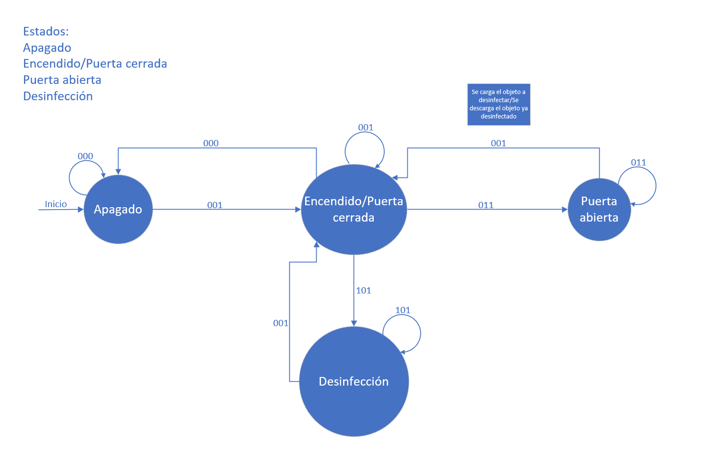

# Trabajo Practico Maquina de Estado - Cabina desinfeccion ozono
Maquina de Estado

## __Memoria Descriptiva__
El sistema presentado es una cabina para desinfección de ropa (u otro objeto) con Ozono. La cual aprovecha que el Ozono (O3) es un gas capaz de eliminar bacterias y virus en pocos minutos. Mediante un proceso de oxidación celular puede desinfectar ropa de trabajo, prendas de moda, artículos de uso cotidiano, gafas, cascos, zapatos, herramientas, etc. No erosiona, no deja olor y no afecta a la calidad de los artículos.

Este sistema realiza diversas funciones, entre ellas, permite la activación de las puertas de la cabina; posee un indicador de humedad dentro del recinto, un botón de activación del mecanismo de desinfección, y un sistema de seguridad o de alerta (detección de fugas, exceso de Ozono, puerta abierta, etc.) el cual se activa ante algún problema y alerta al usuario.

Sensores: 
- S1: Sensor de presión dentro del recinto
- S2: Sensor de humedad dentro del recinto

Pulsadores:
- P1: Pulsador de encendido
- P2: Pulsador de apertura y cierre de puertas
- P3: Pulsador comienzo de desinfección

## __Diagramas de Estado__

A continuación, se observarán 2 diagramas de estado, el primero será la descripción del sistema básico, encendido, apertura de puertas y funcionamiento. Luego habrá otro diagrama en el cual se podrá observar el funcionamiento básico con la adición del sistema de seguridad, el cual contará con control de presión dentro del recinto, para que en caso de que exista una falla en el mismo se de alerta al usuario. El objetivo de distinguir entre estos dos diagramas es el de brindar la posibilidad de modificar/mejorar el sistema de seguridad de ser necesario, teniendo siempre como referencia el diagrama de funcionamiento base.

__Sistema Base:__

En la siguiente tabla podremos observar las condiciones necesarias y posibles combinaciones entre las señales de los pulsadores para poder realizar la desinfección, obteniendo un 1 en Z cuando se cumplan las condiciones necesarias (sin tomar en cuenta sistema de seguridad):

(Los guiones representan las situaciones imposibles/prohibidas dentro del sistema)

__Diagrama de Estado:__

Estados:
- 1 = Apagado
- 2 = Encendido (con puertas cerradas)
- 3 = Puertas Abiertas
- 4 = Desinfección

Tabla de transiciones:

## Diagrama sin sistema de seguridad:

Para que el proceso de desinfección sea llevado a cabo en el sistema básico es necesario que las siguientes condiciones se cumplan:

El pulsador de encendido debe estar activo (en otras palabras, la cabina debe estar encendida) y el pulsador de apertura y cierre de puertas debe estar detectando un cero (posición de cerrado), en caso de que estas condiciones se cumplan el usuario podrá pulsar P3 para dar comienzo al proceso de desinfección.

__Sistema con Seguridad:__

La principal diferencia que podemos observar es que dentro de las condiciones necesarias mencionadas anteriormente para realizar la desinfección se suma el requisito en la presión medida, la cual debe ser igual a la presión indicada (con su respectiva tolerancia).

__Diagrama de Estado:__

Estados:
- 1 = Apagado
- 2 = Encendido (con puertas cerradas)
- 3 = Puertas Abiertas
- 4 = Desinfección
- 5 = Alerta

Tabla de transiciones:

Donde Pm = Presión medida; Pi = Presión indicada. 

Cuando la presión medida dentro del recinto sea superior o inferior al valor de la presión indicada (con su respectiva tolerancia) se pasará automáticamente al estado de alerta imposibilitando al usuario realizar otra acción hasta que el valor de la presión medida sea el adecuado.

## Diagrama con sistema de seguridad:

Para que el proceso de desinfección sea llevado a cabo en el equipo con sistema de seguridad es necesario que las siguientes condiciones se cumplan:

El pulsador de encendido debe estar activo (en otras palabras, la cabina debe estar encendida), el pulsador de apertura y cierre de puertas debe estar detectando un cero (posición de cerrado) y el sensor de presión debe estar censando un valor aceptable dentro del recinto, en caso de que estas condiciones se cumplan el usuario podrá pulsar P3 para dar comienzo al proceso de desinfección. En caso contrario no será posible realizar el proceso de desinfección y se advertirá al usuario mediante un indicador.
